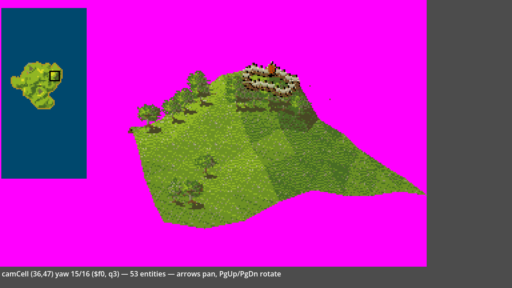
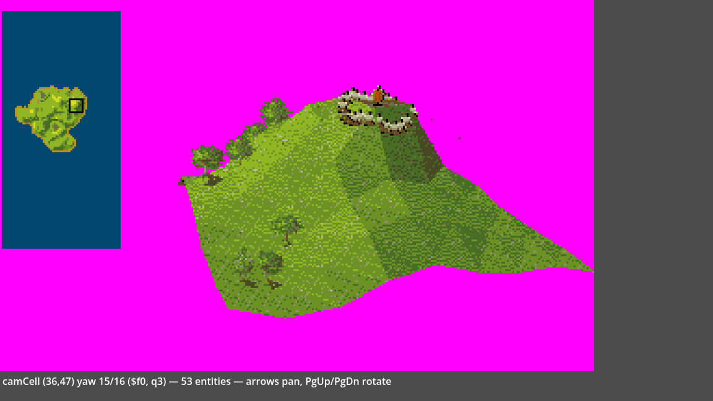
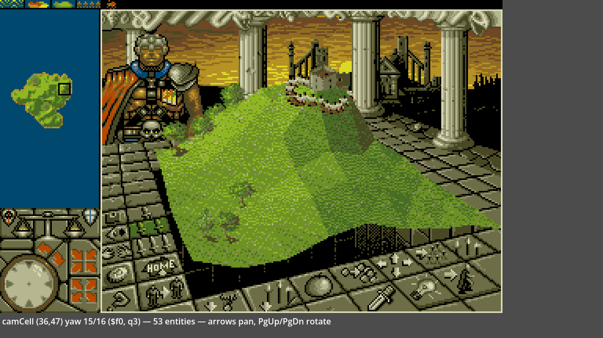

# How PowerMonger draws its world

*2026-09-22T21:40:13Z by Showboat 0.6.1*
<!-- showboat-id: 079d3e8f-b180-44ea-a77f-2ed68f87426b -->

This walks through one frame of PowerMonger's isometric view (Atari ST, 1990), following the data from the heightmap in RAM to the pixels on screen. The code is the F# port in `../godot/logic/`, which reproduces the 68000 routines closely enough to match the game's own frame buffer at 94-98% of pixels, and the terrain alone at 99.7-99.96% away from sprites. Addresses like `$fccc` are routines in the original executable, so every section can be traced back to the disassembly.

The whole renderer, in the order it runs. `$f898` is the driver: once per game tick it re-projects if the camera moved, then runs the walk for the current angle.

| stage | 68000 routine | F# |
|---|---|---|
| read the heightmap window | `$3f86c`, `$438ee` planes | `Terrain.Map` |
| project the 9 x 9 grid of corners | `$fecc` | `Projection.projectGrid` |
| pick the walk for this camera angle | `$f97e` | `Fill.quadrant`, `Fill.plan` |
| visit the 64 cells, two triangles each | `$f98e` / `$fa9a` / `$fbb4` / `$fccc` | `Fill.planQ0`..`planQ3` |
| fill each triangle with a dither pattern | `$ef62`, `$e420`, `$e3e6` | `Fill.ef62Raster`, `ddaWalk`, `ditherIndex` |
| draw each cell's sprites straight after its triangles | `$115e0` | `Scene.steps`, `Sprites.blitEntity` |

There is no depth buffer and no sort. The order of the walk does all the hidden-surface work, and most of this document is about why that is enough.

Everything below runs against the real code. Build it first with `dotnet build ../godot/logic/PmLogic.fsproj` and `dotnet build ../stepper/PmStepper.fsproj`. The live checks call `probe.fsx` in this folder, which prints facts computed by the port; `uvx showboat verify walkthrough.md` re-runs them all.

## 1. The world is a heightmap

The map is 64 x 128 cells. Each cell has four bytes, stored as four separate planes: a **type** byte (what the ground is), a **height** byte, a **flag** byte, and a **control** byte, which is the height the projector uses to lift the corners.

```bash
sed -n '19,21p;28,36p' ../godot/logic/Terrain.fs
```

```output
    type Map =
        { Type: byte[]        // terrain class / colour of the "type" triangle
          HeightPlane: byte[] // $438ee height plane
          Flag: byte[]
          Control: byte[] }   // $3f86c — the height the projector reads

        member m.Index(x, y) = y * Width + x
        member m.ControlAt(x, y) = int m.Control.[m.Index(x, y)]
        member m.TypeAt(x, y) = int m.Type.[m.Index(x, y)]
        member m.HeightAt(x, y) = int m.HeightPlane.[m.Index(x, y)]
        member m.IsWater(x, y) = m.HeightPlane.[m.Index(x, y)] < WaterLevel
        member m.DiagonalSelector(x, y) = m.Flag.[m.Index(x, y)] &&& DiagonalSelectorBit <> 0uy
```

The camera looks at an 8 x 8 block of cells, which needs a 9 x 9 grid of corners. These are the control-plane heights under that grid at the start of mission 1, camera cell (36,47). The hill in the middle is the one you see on screen.

```bash
dotnet fsi probe.fsx heights
```

```output
control-plane heights, corners (36..44, 47..55):
  0c 0a 0e 15 18 16 14 10 09
  14 14 1c 22 21 1e 1b 14 0a
  16 1c 28 30 2e 27 20 15 0a
  14 1d 2b 37 38 2e 22 13 07
  11 18 25 33 3a 3a 23 14 07
  0e 11 1b 27 3a 3a 20 15 07
  0f 0d 14 1d 23 1f 18 11 07
  10 0c 10 18 1c 17 11 0d 06
  11 0b 0b 10 12 0d 0a 09 04
```

## 2. Projecting the corners

`$fecc` turns each corner of the 9 x 9 grid into a screen position. It rotates the grid by the camera yaw, lifts each corner by its height above the lowest corner in view, then divides by the distance from an eye 320 units back. That is an ordinary perspective projection in 68000 integer maths.

The yaw is a byte, 256 units per turn, stepped 16 at a time: 16 angles of 22.5 degrees. The start pose is yaw 15, byte `$f0`. `Zoom` (21) is the size of a cell in world units, and heights are scaled by `Zoom / 16`. `Horizon` (130) is subtracted from each lifted height before the divide and added back after, so it sets where the horizon sits on screen.

```bash
sed -n '26,61p' ../godot/logic/Projection.fs
```

```output
    let yawAngle (p: Params) = deg2rad (float (p.YawSteps * 16) * 1.40625)

    type Corner = { X: float; Y: float }

    /// Project one grid vertex. col,row are relative to the camera cell,
    /// each in -Half .. +Half. h = control-plane height at that cell.
    /// hbias = min control height over the visible window (recomputed per frame).
    let projectVertex (p: Params) (theta: float) (hbias: int) (col: int) (row: int) (h: int) : Corner =
        let sinT = sin theta
        let cosT = cos theta
        let z = ((h - hbias) * int p.Zoom) >>> 4 |> float
        let c = float col * p.Zoom
        let r = float row * p.Zoom
        // rotate by -theta  ($ff36..$ff4e):  rx = (c*Q - r*P)>>15, P=32768 sinT, Q=32768 cosT
        let rx = c * cosT - r * sinT
        let ry = r * cosT + c * sinT
        let d = p.Eye - ry
        let d = if d <= 1.0 then 1.0 else d
        let sx = rx * p.Eye / d
        let sy = (z - p.Horizon) * p.Eye / d + p.Horizon
        { X = sx + 128.0; Y = 124.0 - sy }

    /// Project the whole visible grid. Returns corners indexed [gr, gc],
    /// gr/gc in 0 .. 2*Half. camX,camY = camera cell (already minus $57ffc).
    let projectGrid (p: Params) (m: Terrain.Map) (camX: int) (camY: int) : Corner[,] =
        let n = 2 * p.Half + 1
        let theta = yawAngle p
        // dynamic height bias
        let mutable hbias = 255
        for gr in 0 .. n - 1 do
            for gc in 0 .. n - 1 do
                let hh = m.ControlAt(camX + gc, camY + gr)
                if hh < hbias then hbias <- hh
        Array2D.init n n (fun gr gc ->
            let h = m.ControlAt(camX + gc, camY + gr)
            projectVertex p theta hbias (gc - p.Half) (gr - p.Half) h)
```

Two details matter later. `ry`, the rotated distance along the view direction, is what the divide uses: a larger `ry` means a smaller `d`, so a nearer corner. And nothing is clipped here. All 81 corners are projected whether they are on screen or not; clipping happens one scanline at a time inside the triangle filler.

The result for the start pose, in the raw coordinates the game draws in (it adds 64 px for the HUD strip when it writes to the screen):

```bash
dotnet fsi probe.fsx corners
```

```output
projected corners (screen x, y), rows = grid rows 0..8:
  ( 32, 99) ( 51, 99) ( 68, 92) ( 86, 83) (102, 78) (118, 78) (133, 78) (148, 81) (162, 86)
  ( 34, 95) ( 54, 93) ( 72, 81) ( 90, 73) (108, 72) (124, 74) (140, 75) (155, 81) (170, 90)
  ( 36, 99) ( 57, 89) ( 77, 71) ( 96, 61) (114, 61) (131, 68) (147, 74) (163, 84) (178, 95)
  ( 39,108) ( 61, 93) ( 82, 72) (102, 56) (120, 52) (138, 63) (156, 76) (172, 92) (188,103)
  ( 42,120) ( 65,106) ( 87, 86) (108, 65) (128, 54) (147, 53) (165, 80) (182, 95) (199,109)
  ( 45,133) ( 70,125) ( 93,106) (116, 87) (137, 58) (156, 56) (175, 89) (193,100) (210,116)
  ( 49,143) ( 76,142) (101,126) (124,109) (146, 96) (167, 99) (187,106) (206,112) (224,124)
  ( 53,154) ( 82,156) (109,144) (134,125) (157,115) (180,120) (200,124) (220,127) (239,133)
  ( 59,166) ( 90,171) (119,165) (145,151) (170,142) (194,146) (216,146) (236,143) (256,146)
```

The far edge (row 0) sits higher on screen than the near edge (row 8). Between them the hill lifts rows 1 to 4 above row 0 in places, so the grid folds back on itself on screen. Those back slopes come up again in section 5.

## 3. The walk: far to near, one cell at a time

The game never sorts anything. It visits the 64 cells in a fixed order and draws each cell completely before moving on. Anything drawn later lands on top. This is the painter's algorithm: paint the background first and let nearer things cover it. It only works if nothing is drawn before something that could be in front of it.

Which order is safe depends on where the camera faces, so the game has four copies of the walk and picks one from the yaw (`$f97e`):

```bash
sed -n '406,414p' ../godot/logic/Fill.fs
```

```output
    /// port of $f97e/$f982's dispatch: q = ((yaw+8)>>5)&6, handler = q>>1.
    /// yaw here is yawSteps*16 (Projection.Params.YawSteps, 0..15).
    let quadrant (yawSteps: int) = (((yawSteps * 16 + 8) >>> 5) &&& 6) >>> 1

    /// The whole frame's terrain as a draw plan: the 64 cells in the order
    /// the quadrant handler for this yaw visits them.
    let plan (corners: Projection.Corner[,]) (map: Terrain.Map) (camX: int) (camY: int) (yawSteps: int) =
        let handler = [| planQ0; planQ1; planQ2; planQ3 |].[quadrant yawSteps]
        handler corners map camX camY
```

Each handler is two nested loops of eight. The port splits each one into its two decisions: the order the loops reach the cells, and how each cell is cut into triangles (section 4). In the excerpt, C00 is the cell's top-left corner `corners[row, col]`, C10 the next column, C01 the next row and C11 the diagonal one; `packed` is `(x << 16) | y`, the handlers' way of comparing two screen points. Here is the handler for the start pose, `$fccc`:

```bash
sed -n '314,334p' ../godot/logic/Fill.fs
```

```output
    /// pm_grid_walk_q3 ($fccc), yaw 0xf0 (quadrant 3). `corners` is the
    /// projected 9x9 grid from Projection.projectGrid — gr,gc both 0..2*Half,
    /// which is exactly $3f364's own (row,col) layout, so it plugs in
    /// directly (no re-indexing needed).
    ///
    ///   strip = cell column, EAST -> WEST (far -> near)
    ///   i     = cell row,    NORTH -> SOUTH (far -> near)
    ///   (row, col) = (i, 7 - strip)
    ///   flag CLEAR: split C00-C11, unconditional:
    ///     ef62(C10,C11,C00,type) ; ef62(C01,C00,C11,height)
    ///   flag SET: split C10-C01, sub-order by packed(C01) <= packed(C10)
    let planQ3 (corners: Projection.Corner[,]) (map: Terrain.Map) (camX: int) (camY: int) : Cell list =
        let visit = visit corners map camX camY (fun q ->
            if not q.Diagonal then
                tri q.C10 q.C11 q.C00 q.TypeByte, tri q.C01 q.C00 q.C11 q.HeightByte
            elif packed q.C01 <= packed q.C10 then
                tri q.C00 q.C10 q.C01 q.HeightByte, tri q.C11 q.C01 q.C10 q.TypeByte
            else
                tri q.C11 q.C01 q.C10 q.TypeByte, tri q.C00 q.C10 q.C01 q.HeightByte)
        [ for strip in 0 .. 7 do
            for i in 0 .. 7 -> visit (strip, i) (i, 7 - strip) ]
```

Laid out on the grid, the order `planQ3` produces at yaw 15, then the order at yaw 7, where the camera faces the opposite way and handler q1 runs. Each number is when that cell is drawn:

```bash
dotnet fsi probe.fsx order 15 && dotnet fsi probe.fsx order 7
```

```output
yaw 15 -> handler q3; visit order laid out by grid (row down, col across):
  57 49 41 33 25 17  9  1
  58 50 42 34 26 18 10  2
  59 51 43 35 27 19 11  3
  60 52 44 36 28 20 12  4
  61 53 45 37 29 21 13  5
  62 54 46 38 30 22 14  6
  63 55 47 39 31 23 15  7
  64 56 48 40 32 24 16  8
yaw 7 -> handler q1; visit order laid out by grid (row down, col across):
   8 16 24 32 40 48 56 64
   7 15 23 31 39 47 55 63
   6 14 22 30 38 46 54 62
   5 13 21 29 37 45 53 61
   4 12 20 28 36 44 52 60
   3 11 19 27 35 43 51 59
   2 10 18 26 34 42 50 58
   1  9 17 25 33 41 49 57
```

The order is not strictly far to near. At yaw 15, cell 8 (bottom right, near) is drawn before cell 9 (top of the next column, far). What holds is weaker and enough: every cell is drawn after every cell that is farther along **both** grid axes.

The projection says why. Depth is `ry = row * cos(yaw) + col * sin(yaw)`. For yaw 12 to 15, cos is positive and sin is negative, so a cell gets nearer as its row goes up and as its column goes down. `planQ3` runs columns from high to low and, within a column, rows from low to high, so any cell that is nearer in both directions comes later. The other three handlers do the same for their quarter turn, and `quadrant` switches at yaw 0, 4, 8 and 12, the angles where cos or sin is zero. Within a quarter turn the signs never change, so one grid order serves all four angles.

Cells that are not ordered this way, like 8 and 9, sit side by side across the view. The walk relies on those not overlapping on screen; the port has not tested that beyond matching the game's frames. One pass of the outer loop, eight cells, is what the viewer calls a **strip**.

## 4. Splitting a cell into two triangles

A cell's four corners are generally not in one plane, so the game draws each cell as two triangles. The plan records each one as data:

```bash
sed -n '261,293p' ../godot/logic/Fill.fs
```

```output
    /// One triangle as the walk hands it to $ef62: three projected corners
    /// (in the order passed, which $ef62's cyclic sort depends on) and the raw
    /// terrain byte that picks its colour. The water shimmer (+tick) is
    /// applied at draw time by ef62Raster, not here.
    type Tri =
        { A: Projection.Corner
          B: Projection.Corner
          C: Projection.Corner
          Colour: int }

    /// One cell's four projected corners and the three bytes its split reads.
    ///   C00 = corners.[row,   col]    C10 = corners.[row,   col+1]
    ///   C01 = corners.[row+1, col]    C11 = corners.[row+1, col+1]
    type Quad =
        { C00: Projection.Corner; C10: Projection.Corner
          C01: Projection.Corner; C11: Projection.Corner
          TypeByte: int          // type plane: colours one triangle
          HeightByte: int        // height plane: colours the other
          Diagonal: bool }       // flag-plane bit 7 (Terrain.DiagonalSelector)

    /// One cell visit, in walk order.
    type Cell =
        { X: int; Y: int         // world cell
          Row: int; Col: int     // its top-left corner in the 9x9 projected grid
          Order: int             // position in the walk, 0..63 = strip * 8 + i
          Quad: Quad
          First: Tri             // drawn first ...
          Second: Tri }          // ... then this one over it

        /// Outer-loop pass 0..7: the far -> near strip of 8 cells it belongs to.
        member c.Strip = c.Order / 8
        /// Inner-loop index 0..7 within its strip.
        member c.InStrip = c.Order % 8
```

Three things decide the two triangles:

- **Which diagonal.** Bit 7 of the flag plane picks the diagonal per cell: clear splits C00 to C11, set splits C10 to C01. The map stores the choice, so a ridge can run along the fold instead of across it.
- **Which colour.** One triangle takes the cell's type byte, the other its height byte. There is no lighting model. The byte selects one of 128 dither patterns (section 6), and the patterns are laid out so that height reads as shading. That is why a sloped grass cell shows a subtle two-tone split.
- **Which goes first.** The walk fixes the order of the two triangles, and for some diagonals it compares the corners' packed screen positions to decide. When a steep cell folds over itself on screen, the second triangle is the one you see.

The first cell the start pose draws:

```bash
dotnet fsi probe.fsx split
```

```output
first cell visited: world (43,47), grid row 0 col 7, strip 0
  C00 (148, 81)  C10 (162, 86)  C01 (155, 81)  C11 (170, 90)
  type byte $26  height byte $25  flag bit 7 clear: split C00-C11
  first  tri (162, 86) (170, 90) (148, 81) colour $26
  second tri (155, 81) (148, 81) (170, 90) colour $25
```

## 5. Filling a triangle: `$ef62` and the span walker

`$ef62` takes three corners and a colour byte and fills the triangle one scanline at a time. Its outline, from the port's doc comment:

```bash
sed -n '166,181p' ../godot/logic/Fill.fs
```

```output
    /// pm_tri_raster ($ef62) → the $e420 DDA span walker. Ports:
    ///   * the cyclic-rotate Y sort ($efbe..$efd4)
    ///   * general vs flat-top split ($efe0..$f13c), incl. the $f134 reorder
    ///   * per-edge 16.16 slope via fixedSlope ($f000)
    ///   * "force colourByte 0x1c" on reversed winding ($f072/$f154): general
    ///     -> mid vertex already LEFT (slope(top->bot) > slope(top->mid)); flat-
    ///     top -> right apex X < left. Back-facing; mostly overdrawn (118th).
    ///   * the mid-vertex slope switch: the edge on the mid vertex's side
    ///     reloads to slope(mid->bot) at scanline (mid.y - top.y) — run-
    ///     counter expiry ($e42a/$e43e), consuming record[20]/[22]. Both
    ///     non-apex edges walk from the apex; whichever's run counter expires
    ///     first is the one that bends, so triangle height = max(dy1, dy2),
    ///     NOT necessarily the cyclic-3rd vertex's dy (the cyclic sort does
    ///     not guarantee it is the true bottom).
    ///   * water shimmer: colour += tick if colour < 0x0c (walk_q3 passes the
    ///     raw plane byte, same as $fccc).
```

It finds the top vertex, works out how far each edge moves in x per scanline, then hands two edges to the span walker `$e420`, which fills between them row by row. When one edge reaches the middle vertex it bends toward the bottom one.

The per-scanline step is a 16.16 fixed-point slope from `$f000`. The 68000's `divu` divides 32 bits by 16 and returns a 16-bit quotient, so `(|dx| << 16) / dy` overflows as soon as `|dx| >= dy`. For those edges, flatter than 45 degrees, the routine divides in two stages and loses the low 8 bits of the fraction. (The source comment's "steep" means steep in x.)

```bash
sed -n '50,63p' ../godot/logic/Fill.fs
```

```output
    /// $f000 — signed 16.16 fixed-point edge-slope magnitude, sign from dx.
    /// dy is the (positive) run in scanlines. Steep (dy <= |dx|) truncates
    /// the divide *before* the final <<8 ($f01a's two-stage divide) — this is
    /// NOT the same value as a single (|dx|<<16)/dy; the rounding difference
    /// matters for span endpoints. divu overflow clamps to exactly 0x10000.
    let fixedSlope (dx: int) (dy: int) : int =
        let adx = abs dx
        let v =
            if dy <= adx then
                let q = (adx <<< 8) / dy
                if q > 0xFFFF then 0x10000 else (q &&& 0xFFFF) <<< 8
            else
                ((adx <<< 16) / dy) &&& 0xFFFF
        if dx < 0 then -v else v
```

```bash
dotnet fsi probe.fsx slope
```

```output
   dx  dy   $f000 16.16     naive (dx<<16)/dy
    7   3   00025500 (   2.3320)   00025555 (   2.3333)
   10   3   00035500 (   3.3320)   00035555 (   3.3333)
    3   7   00006db6 (   0.4286)   00006db6 (   0.4286)
   -5   2   fffd8000 (  -2.5000)   fffd8000 (  -2.5000)
  200   1   00c80000 ( 200.0000)   00c80000 ( 200.0000)
```

7/3 comes out as 2.3320 instead of 2.3333, and 3/7, a steep edge, is exact. The error is about a thousandth of a pixel per row, so it only matters when a span end lands close to a pixel boundary, but then it decides which pixel is drawn. The port keeps it because matching the game pixel for pixel depends on those boundary cases.

The span walker keeps a left and a right x accumulator and adds each edge's slope once per row:

```bash
sed -n '119,164p' ../godot/logic/Fill.fs
```

```output
    /// $e420 — two 16.16 X accumulators (left/right), each stepped one slope
    /// per scanline; row 0 uses the start X with no step ($e41a `bra $e456`).
    /// Draws rows 0 .. totalRows-1: each edge's run counter is decremented per
    /// row ($e42a/$e43e) and a zero run ends the walk before the row is drawn
    /// (the stream ends with a zero run: $f12c / $f13e clear record[20]).
    /// A switching edge reloads its slope at its own `switch` row (the
    /// shorter edge bending toward the far vertex). Aborts the WHOLE triangle
    /// (remaining rows too) the first time ixR < ixL ($e468). The
    /// $ec62/$eca2 partial-word edge masks reduce exactly to "draw pixel x
    /// iff ixL <= x <= ixR" for a per-pixel index buffer — no planar masking
    /// needed. $ef62's own clip is screenX <= 255 (the iso window's right
    /// edge, not the 320px screen). Returns the row it aborted at, if any.
    let private ddaWalk (buf: Buffer) (dith: byte[]) (colour: int) (topY: int) (totalRows: int)
                         (xL: int) (slopeL: int) (switchL: int option) (slopeL2: int)
                         (xR: int) (slopeR: int) (switchR: int option) (slopeR2: int) =
        let mutable pL = int64 xL <<< 16
        let mutable pR = int64 xR <<< 16
        let mutable sL = slopeL
        let mutable sR = slopeR
        let mutable aborted = false
        let mutable abortRow = None
        let mutable row = 0
        while not aborted && row < totalRows do
            if row > 0 then
                pL <- pL + int64 sL
                pR <- pR + int64 sR
            match switchL with
            | Some sw when sw = row -> sL <- slopeL2
            | _ -> ()
            match switchR with
            | Some sw when sw = row -> sR <- slopeR2
            | _ -> ()
            let y = topY + row
            if y >= 0 && y < ScreenHeight then
                let ixL = int (pL >>> 16)
                let ixR = int (pR >>> 16)
                if ixR < ixL then
                    aborted <- true
                    abortRow <- Some row
                elif ixL <= 0xFF then
                    let xs = max 0 ixL
                    let xe = min (ScreenWidth - 1) (min ixR 0xFF)
                    for x in xs .. xe do
                        buf.Set(x, y, ditherIndex dith colour y x)
            row <- row + 1
        abortRow
```

Three behaviours to notice:

- **It clips per row.** Rows off the top or bottom are stepped but not drawn, and x stops at 255, the right edge of the isometric window. Nothing earlier in the pipeline clips.
- **It stops one row short.** The loop runs `row < totalRows`: each edge's run counter is decremented per row, and a count reaching zero ends the walk before that row is drawn. So the bottom vertex's own scanline is never filled; the next triangle down covers it. (The port used to draw that row too, which left a one-pixel line of wrong colour under every triangle; comparing against the game's frames found it.)
- **It can give up.** If the right accumulator ever lands left of the left one, the rest of the triangle is abandoned (`$e468`).
- **It can change the colour.** If the corners arrive with reversed winding (the middle vertex turns out to be on the left), `$ef62` swaps the edges and forces colour byte `$1c`, a dark pattern. SPEC.md records this as an override whose purpose is still open.

Counting what actually happens to the start frame's 128 triangles:

```bash
dotnet fsi probe.fsx rasters
```

```output
reversed winding ($1c forced) on 52 triangles, first at steps [1; 3; 7; 8]
span walk aborted on 0 triangles; rows lost -> how many: []
skipped by $ef62: 0 []; drawn but fully clipped: 0
$1c triangles drew 3298 px; 6 px of them are visible in the finished frame (of 13725 terrain px)
```

No triangle gives up in this frame. Before the row fix there were 21 aborts, every one on the extra last row, where the two edges had already crossed: the abort was the port running past the end of the triangle, not a real early exit.

The `$1c` numbers are more interesting. Two in five triangles come out with reversed winding, and they draw 3298 pixels, but only 6 of those pixels survive to the finished frame. Every walk hands `$ef62` its corners in the same winding on the grid, so a triangle that comes out reversed on screen is facing away from the camera: it is the far side of a slope. The walk then draws nearer terrain over it. At this pose, the override paints back faces dark and the painter's algorithm hides them. That is one pose, so the general purpose stays open.

## 6. The colour is a dither pattern

The ST shows 16 colours at once, so a colour byte cannot be a colour. It is an index into a 16 KB table of patterns at `$2e000`: 128 slots of 128 bytes. For a pixel at (x, y), `$e3e6` and `$e420` read the slot for the colour byte, step 8 bytes per scanline (wrapping inside the slot), and take a 16-pixel, 4-bitplane pattern from there. Every span on a scanline uses the same 16-pixel pattern, tiled from the left edge of the screen:

```bash
sed -n '65,88p' ../godot/logic/Fill.fs
```

```output
    /// $e3e6 setup + the $e420/$e44a roll. Live single-stepped (80th pass):
    /// A5 wraps MODULO 128 inside the colour's 128-byte slot (the $e44a
    /// roll's `addq.b #8` on `2*A5` byte-overflows at `A5 & 0x7f == 124`), so
    /// the phase depends only on colourByte and the absolute scanline y — the
    /// topY term drops out under the mod. The whole span on one scanline is
    /// ONE 16-px pattern (planes 0/1 = the big-endian long at A5, planes 2/3
    /// = the long at A5+4), tiled screen-X-aligned.
    let ditherIndex (dith: byte[]) (colourByte: int) (y: int) (x: int) : byte =
        let colourByte = max 0 colourByte
        let mutable a5 = colourByte * 128 + ((8 * y) &&& 0x7F)
        if a5 + 8 > dith.Length then
            a5 <- (dith.Length - 8) &&& ~~~1
        let u32be (i: int) =
            (uint32 dith.[i] <<< 24) ||| (uint32 dith.[i + 1] <<< 16)
            ||| (uint32 dith.[i + 2] <<< 8) ||| uint32 dith.[i + 3]
        let l0 = u32be a5
        let l1 = u32be (a5 + 4)
        let b = 15 - (x &&& 15)
        let p0 = (l0 >>> (16 + b)) &&& 1u
        let p1 = (l0 >>> b) &&& 1u
        let p2 = (l1 >>> (16 + b)) &&& 1u
        let p3 = (l1 >>> b) &&& 1u
        byte (p0 ||| (p1 <<< 1) ||| (p2 <<< 2) ||| (p3 <<< 3))

```

The pattern depends only on the colour byte and the screen row, never on where the triangle is, so neighbouring triangles with the same byte join without a seam. The first cell's two bytes, as palette indices:

```bash
dotnet fsi probe.fsx dither
```

```output
colour byte $26, x 0..31, scanlines 0..5 (palette indices, hex):
  y=0  ddd2ccccdccddcddddd2ccccdccddcdd
  y=1  cccddcd3cdcdcdcccccddcd3cdcdcdcc
  y=2  dddc3dccdcdcc3dddddc3dccdcdcc3dd
  y=3  ccc32cddcdcdddddccc32cddcdcddddd
  y=4  cdddcdccdddccccccdddcdccdddccccc
  y=5  dcdcdcddc2cddddddcdcdcddc2cddddd
colour byte $25, x 0..31, scanlines 0..5 (palette indices, hex):
  y=0  dd3dcdccdddcc2dddd3dcdccdddcc2dd
  y=1  dcdddc3dcdcddddddcdddc3dcdcddddd
  y=2  3ddddddddddccdcc3ddddddddddccdcc
  y=3  dddcdcdd2c2dddd2dddcdcdd2c2dddd2
  y=4  cdcdddddd2ddcdcccdcdddddd2ddcdcc
  y=5  dddccdccdcdddcdddddccdccdcdddcdd
```

Both are mostly palette 12 and 13, in different proportions, with a few other indices scattered in. Each row repeats every 16 pixels and changes from row to row. Stepping the byte through the table steps through blends, which is how height becomes shading without any lighting maths.

There is one more input: a phase. The pattern pointer lives at `$ffa2`, and every time the camera moves, rotates or zooms, `$f898` flips bit 7 of its low byte (`bchg #7,$ffa5` at `$f8e4`) before re-projecting. After the pointer is halved, that moves every read 64 bytes, 8 scanlines, through the slot, and the next camera change moves it back. So the whole landscape's texture jumps half a pattern each time you turn. The port applies it as `Fill.withPhase`, which rotates each slot by the phase:

```bash
sed -n '89,100p' ../godot/logic/Fill.fs
```

```output
    /// The dither phase. $e3e6 reads patterns through the pointer [$ffa2] >> 1.
    /// $f898 sets [$ffa2] = 2 * [$ff9e] (the table base) on its first call,
    /// then flips bit 7 of its low byte (`bchg #7,$ffa5`, $f8e4) every time it
    /// re-projects because the camera cell, yaw or zoom changed. So the read
    /// point moves by 64 bytes (8 scanlines) inside every 128-byte colour slot,
    /// and moves back on the next camera change. Rotating each slot by `phase`
    /// (0 or 64) gives the table $e3e6 effectively reads; pass the result
    /// wherever `dith` goes. Measured on captures rotated in the emulator: terrain
    /// match 43-47% without the phase, 85-94% with it.
    let withPhase (dith: byte[]) (phase: int) : byte[] =
        if phase &&& 0x7F = 0 then dith
        else Array.init dith.Length (fun i -> dith.[(i &&& ~~~0x7F) + (((i &&& 0x7F) + phase) &&& 0x7F)])
```

On captures rotated inside the emulator, modelling the phase takes the port's terrain match from 43-47% to 85-94%. The stepper and the Godot view flip it on every camera change, as the game does.

## 7. Sprites go inside the walk

Trees, buildings, men, animals and banners hang off the cells. Each cell has a bucket at `$47970` holding a linked list of object records. The walk handler calls `$115e0` for a cell right after drawing that cell's two triangles, and `$115e0` draws every record in the bucket before the walk moves on. `Scene.fs` builds the frame that way, as one list of steps:

```bash
sed -n '15,42p' ../godot/logic/Scene.fs
```

```output
    /// One thing the renderer draws, in frame order. Each step carries its
    /// cell, so it can be drawn (or highlighted) on its own.
    type Step =
        | Triangle of cell: Fill.Cell * nth: int * tri: Fill.Tri     // nth = 1 or 2 within the cell
        | Sprite of cell: Fill.Cell * record: Sprites.EntityRec

    /// The cell a step belongs to.
    let cellOf step =
        match step with
        | Triangle(c, _, _) | Sprite(c, _) -> c

    /// Interleave each cell's sprites after its triangles, in the order the
    /// walk visits the cells. Records whose category has no frame to draw
    /// (see Sprites.entityFrame) are left out; records outside the visible
    /// 8x8 are never reached. Within a cell, records keep the order given,
    /// which is their bucket-chain order.
    let steps (ctx: Sprites.EntityCtx) (cells: Fill.Cell list) (recs: Sprites.EntityRec seq) : Step[] =
        let byCell =
            recs
            |> Seq.filter (fun r -> (Sprites.entityFrame ctx r).IsSome)
            |> Seq.groupBy (fun r -> r.Wcx, r.Wcy)
            |> dict
        [| for c in cells do
             yield Triangle(c, 1, c.First)
             yield Triangle(c, 2, c.Second)
             match byCell.TryGetValue((c.X, c.Y)) with
             | true, rs -> for r in rs -> Sprite(c, r)
             | _ -> () |]
```

```bash
dotnet fsi probe.fsx steps
```

```output
173 steps: 128 triangles (64 cells x 2) + 45 sprites
first cell with sprites, in draw order:
  triangle  cell (43,48) colour $24
  triangle  cell (43,48) colour $23
  sprite    cell (43,48) byte6 4
```

(`byte6` is the record's category byte; 4 is a building or tree. SPEC.md §6 lists the categories.)

The obvious simplification, drawing all the terrain first and then all the sprites on top, gives a different picture, and the port did it that way before this document was written. The test is to render a captured frame both ways and compare each with the game's own screen at the pixels where the two orders disagree. On six captures, three of them rotated to other camera angles inside the emulator, the game sides with the inline order almost every time:

```bash
grep -A 7 '| capture | terrain only' ../SPEC.md
```

```output
| capture | terrain only | sprites last (`drawEntities`) | inline (`Scene.render`) | px where the orders differ: game = last / inline / neither |
|---|---|---|---|---|
| `pm88_f1` (yaw `$f0`) | 94.1% | 89.17% | **96.80%** | 1 / 1159 / 18 of 1178 |
| `pm78_settle` (`$f0`) | 94.6% | 86.02% | **93.66%** | 1 / 1159 / 18 of 1178 |
| `pm74_late` (`$f0`) | 94.4% | 90.83% | **96.80%** | 3 / 897 / 14 of 914 |
| `rot40` (`$40`) | 94.4% | 90.98% | **97.83%** | 28 / 1267 / 62 of 1357 |
| `rot90` (`$90`) | 84.8% | 94.03% | **96.57%** | 20 / 361 / 55 of 436 |
| `rotc0` (`$c0`) | 91.1% | 89.78% | **94.26%** | 8 / 624 / 25 of 657 |
```

The inputs are `.ram` captures of the running game, which stay out of the repository, so this table is quoted from SPEC.md rather than re-run here. `pm78_settle` scores lower overall because its two compose buffers are known to disagree on the entity layer; the comparison at the differing pixels still comes out the same way. The records only depend on the camera cell, so the same sprites are drawn at every yaw; only men's and animals' facing frames follow the camera. The castle keep in the hilltop fort is its own category (`byte6` 2, `$117d8`): a building frame from the tree sheet, anchored on the cell's centre.

Inline drawing matters because nearer terrain has to be able to cover a sprite. A tree on the far side of a hill is drawn when its cell comes up, and then the hill's nearer cells are drawn over it. How much sprite work the start frame throws away:

```bash
dotnet fsi probe.fsx occlusion
```

```output
45 sprites wrote 4378 px; 2689 of those px were later painted over
most-covered sprites (step, cell, kind, px drawn -> px left visible):
  step  19  cell (42,47) strip 1  byte6  4  181 ->   0
  step  37  cell (41,47) strip 2  byte6  4  181 ->   0
  step  38  cell (41,47) strip 2  byte6  4  181 ->   0
```

More than half the sprite pixels are painted over, and whole trees are drawn only to vanish. The game pays that cost rather than work out what is visible. Sprites drawn after all the terrain (top) put the trees behind the hilltop over the hill; drawn inline (bottom), the hill hides them, as it does in the game:





## 8. Watching it happen: the frame stepper

Because the frame is now a list of steps, it can be replayed. `../stepper` is a small Mibo (raylib) app that draws the frame one triangle or sprite at a time, with pause, single steps by triangle, cell or strip, rewind, and overlays for the corner grid, the walk order, and the current triangle or sprite frame. Run it with `dotnet run --project ../stepper`; B toggles the game's backdrop behind the island.

It draws each step once into a buffer that logs its writes, so it knows exactly which pixels each step sets and in what order:

```bash
sed -n '34,54p' ../stepper/Replay.fs
```

```output
      Writes: Write[][] }            // Writes.[i] = the pixels Steps.[i] writes, in order

/// Draw one step alone and keep its write log.
let private record (dith: byte[]) (ctx: Sprites.EntityCtx) (tick: int) (step: Scene.Step) =
    let buf = Fill.Buffer.Logged()
    let raster = Scene.drawStep buf dith tick ctx step
    let writes =
        [| for packed in buf.Log.Value ->
             let i = packed >>> 8
             { X = i % W; Y = i / W; Index = byte (packed &&& 0xFF) } |]
    raster, writes

/// Build the replay for one camera. The entity records were captured at one
/// camera cell (their prop jitter depends on it), so sprites are included
/// there, at any yaw: positions come from the cell's projected corners, and
/// the yaw only picks men's and animals' facing frames. Checked against the
/// game at yaws $40/$90/$c0 (SPEC.md §6, draw order).
let build (a: Load.Assets) (camX: int) (camY: int) (yawSteps: int) (ditherPhase: int) (tick: int) : Frame =
    let corners = Projection.projectGrid (Projection.Params.Mission1.WithYaw yawSteps) a.Map camX camY
    let hasSprites = camX = a.EntityCamX && camY = a.EntityCamY
    let ctx = { a.EntityCtx with Yaw = yawSteps * 16 }
```

A position in the frame is a step number plus a pixel count within that step, and any position can be rebuilt by replaying the log up to it:

```bash
awk 'NR>=58 && NR<=75; NR==76 {print "..."}; NR>=113 && NR<=122' ../stepper/Replay.fs
```

```output
      Steps = steps
      Rasters = Array.map fst recorded
      Writes = Array.map snd recorded }

// -- where playback is ---------------------------------------------------

/// `Step` steps are finished and `Pixel` pixels of the next one are drawn.
[<Struct>]
type Cursor = { Step: int; Pixel: int }

let start = { Step = 0; Pixel = 0 }
let finish (f: Frame) = { Step = f.Steps.Length; Pixel = 0 }
let isFinished (f: Frame) (c: Cursor) = c.Step >= f.Steps.Length

/// Advance by `n` pixel writes, carrying across step boundaries. Steps that
/// write nothing (a triangle clipped away, say) are passed over.
let advance (f: Frame) (n: int) (c: Cursor) : Cursor =
    let mutable step, pixel, left = c.Step, c.Pixel, n
...

/// Pixel writes up to the cursor, and in the whole frame (for a progress bar).
let written (f: Frame) (c: Cursor) =
    (Array.sumBy Array.length f.Writes.[.. c.Step - 1]) + c.Pixel
let total (f: Frame) = Array.sumBy Array.length f.Writes

/// Replay every write up to the cursor into `idx` (palette index per pixel,
/// -1 where nothing has been drawn yet).
let composeInto (idx: int[]) (f: Frame) (c: Cursor) =
    System.Array.Fill(idx, -1)
```

Playback runs finer than the ST ever drew: `$e420` writes 16-pixel words per bitplane and the sprite blitter writes whole byte rows, so pixel-by-pixel playback is a presentation choice. The order of spans, rows, triangles and sprites is the game's.

The replay is checked against the renderer at every yaw: finishing the replay must give exactly the frame `Scene.render` draws, and stepping forward then back by any chunk must land where it started.

```bash
dotnet run --project ../stepper --no-build -- --selfcheck | tr -d '\r'
```

```output
yaw  0  steps 173  writes 23532  replay==render true  forward/back round trip true
yaw  1  steps 173  writes 23864  replay==render true  forward/back round trip true
yaw  2  steps 173  writes 24632  replay==render true  forward/back round trip true
yaw  3  steps 173  writes 26284  replay==render true  forward/back round trip true
yaw  4  steps 173  writes 27085  replay==render true  forward/back round trip true
yaw  5  steps 173  writes 26733  replay==render true  forward/back round trip true
yaw  6  steps 173  writes 25355  replay==render true  forward/back round trip true
yaw  7  steps 173  writes 23726  replay==render true  forward/back round trip true
yaw  8  steps 173  writes 22093  replay==render true  forward/back round trip true
yaw  9  steps 173  writes 21488  replay==render true  forward/back round trip true
yaw 10  steps 173  writes 22363  replay==render true  forward/back round trip true
yaw 11  steps 173  writes 22947  replay==render true  forward/back round trip true
yaw 12  steps 173  writes 23111  replay==render true  forward/back round trip true
yaw 13  steps 173  writes 23296  replay==render true  forward/back round trip true
yaw 14  steps 173  writes 23810  replay==render true  forward/back round trip true
yaw 15  steps 173  writes 23578  replay==render true  forward/back round trip true
```

## 9. Redoing it in Godot

There are two ways to put this in Godot, and they answer different questions.

**Route A: run the game's renderer and show its output.** This is what `../godot` does today. The F# above draws a 320 x 200 palette-index buffer on the CPU exactly as the game does, and a thin C# node copies it into an `ImageTexture` whenever the camera moves:

```bash
awk 'NR>=156 && NR<=181; NR==182 {print "        ..."}; NR==192; NR==193 {print "        ..."}; NR==233' ../godot/game/TerrainView.cs
```

```output
        using var doc = JsonDocument.Parse(FileAccess.GetFileAsString(path));
        var rgb = doc.RootElement.GetProperty("palettes")[0].GetProperty("rgb");
        for (int i = 0; i < 16; i++)
        {
            var c = rgb[i];
            _palette[i] = Color.Color8(
                (byte)c[0].GetInt32(), (byte)c[1].GetInt32(), (byte)c[2].GetInt32());
        }
    }

    private void RenderFrame()
    {
        var proj = Proj;
        var corners = PmProjection.projectGrid(proj, _map, _camX, _camY);
        var buf = Fill.Buffer.Create();

        // Terrain + the per-cell entity pass (SPEC.md section 6). Scene.render
        // draws each cell's sprites straight after its two triangles, the way
        // $f898 calls $115e0 inline (118th: scored against three captured
        // frames, the game's screen matches this order, not sprites-last).
        // The records in entities.json are baked for the mission-1 start camera
        // cell, so they are drawn when the camera is on that cell. Both
        // paths write RAW $3f364 coordinates, so the XInset shift below places
        // terrain and sprites together.
        bool entPose = _camX == _entCamX && _camY == _entCamY;
        if (entPose && _entRecs.Length > 0)
        ...

        ...
        }
```

Everything the port reproduces stays as the game draws it: the dither and its phase, the clipping, the `$1c` override, the row the span walker stops short of. The island is drawn over the game's own `$78000` master screen (HUD, lord portrait, temple backdrop, minimap), exported once as `assets/backdrop.bin`, since the game never changes it. Against the game's frames that is 94-98% of pixels, and nearly all of the rest are sprites.

 The cost is that Godot is only a window. You cannot zoom smoothly, light it, or run it above 320 x 200 without changing what it is.

**Route B: rebuild it with the engine's own tools.** Each stage maps onto something Godot already does, and several of the game's tricks become unnecessary:

| the game | why it does it | Godot equivalent |
|---|---|---|
| `$fecc` projects 81 corners with an integer perspective divide | no GPU | a `Camera3D` with a perspective projection, and the grid (or the whole 64 x 128 map) built once as an `ArrayMesh` with the control plane as vertex heights |
| per-cell diagonal from flag bit 7 | ridges follow the terrain | the same choice, made when writing the mesh indices: emit each cell's two triangles along the flagged diagonal |
| one colour byte per triangle | no lighting model | flat shading: give each triangle its own three vertices carrying its colour byte, or write the byte into a small per-cell texture |
| 128-slot dither table indexed by colour byte and screen row | 16 colours on screen | a fragment shader that samples `dither.bin` as a texture using the colour byte and `FRAGCOORD`, which keeps the screen-locked look; or drop it and use the palette colours directly |
| four walk handlers and sprites drawn inline | painter's algorithm instead of a depth buffer | the depth buffer; draw order stops mattering |
| `$1c` on reversed winding, then covered by nearer terrain | back faces have to be drawn and hidden | back-face culling, which a spatial shader does by default |
| sprites anchored on their cell's corners | 2D blitter | `Sprite3D` billboards at the same sub-cell point, with `alpha_cut` set to discard and nearest filtering, so they write depth and a hill hides a tree for free |

Route B is the better engine port and the worse history lesson: the walk order, the inline sprites and the `$1c` override all disappear into the depth buffer and back-face culling. Seeing the two side by side shows that those three pieces of the game exist to get the effect of a depth buffer on a machine without one.

For the look of Route A with the structure of Route B, keep the mesh and camera from Route B and move the fill into the shader: a flat colour byte per triangle, the dither looked up from `FRAGCOORD`, and the palette applied at the end. `../../graphics.md` ("What a modern port would do differently") covers the performance side of the same question for a port that stays in software.

## Where to go from here

- `../SPEC.md` is the full porting contract, with every constant and address.
- `../../graphics.md` has the 68000-level detail behind each section here.
- `dotnet run --project ../stepper` shows every step above live. Press N to number the cells in walk order, G for the corner grid, and Right to step one triangle at a time.

